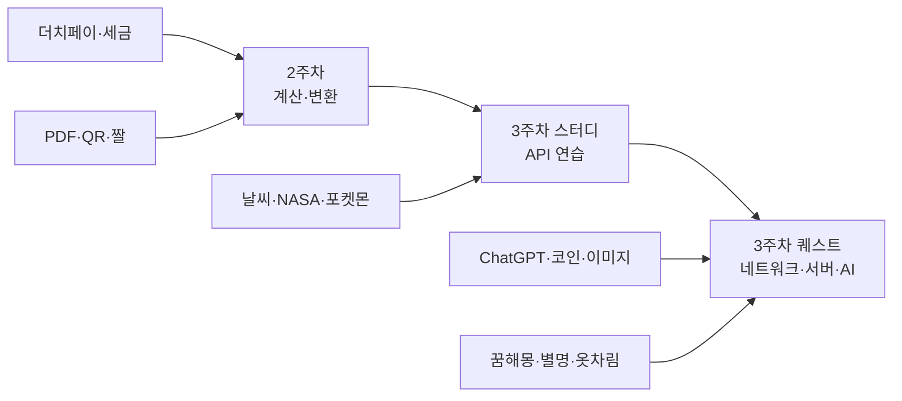

# suyong — 대충 짐작해본 사람 프로필

> 이 문서는 워크스페이스의 프로젝트, 폴더 구조, 대화 기록, 커밋 히스토리를 바탕으로 **AI가 추측한** 프로필입니다.  
> 정확한 사실이 아니라, 패턴에서 읽힌 인상에 가깝습니다.

---

## 한 줄 요약

**"실생활에 쓸 만한 걸 직접 만들어보며, AI와 함께 배우고 정리하는 꼼꼼한 실용주의 학습자"**

---

## 기본 스펙 (추정)

| 항목 | 추측 |
|------|------|
| 이름/닉 | suyong |
| 환경 | macOS, Cursor + Claude 병행 사용 |
| 학습 맥락 | 하버스쿨 AI 교육 (주차별 커리큘럼) |
| 기술 성향 | 빌드 도구 없이 HTML 하나로 끝내는 방식 선호 |
| 언어 | 한국어 중심, 코드·폴더명은 영어 태그 혼용 |

---

## 성격 & 작업 스타일

### 1. 실용주의자

만드는 앱이 대부분 **일상에서 바로 쓸 법한 것**입니다.

- 더치페이·세금 계산기 → 돈 문제
- 날씨 기반 옷차림 추천 → 아침에 뭐 입지?
- 코인 시세 대시보드 → 관심 있는 시장
- PDF·QR·짤 생성기 → 필요할 때 꺼내 쓰는 도구

"배우기 위해 만든다"기보다 **"쓰면서 배운다"**에 가깝습니다.

### 2. 꼼꼼하고, 틀리면 바로 잡는다

더치페이 프로젝트가 잘 보여줍니다.

- 처음엔 "각자 먹은 메뉴" 방식이었는데, **"더치페이는 N빵이지"** 하고 본질을 짚어 수정 요청
- 1차·2차 차수 계산 추가 후, **브라우저에서 직접 검증** 요청
- 버그(차수 멤버 덮어쓰기)가 나오면 끝까지 확인

"대충 돌아가면 됐다"가 아니라 **로직이 맞는지**를 신경 씁니다.

### 3. 디자인에 관심 많음 (취향도 분명함)

- 토스 스타일을 시도했다가 **"마음에 안 든다"**고 솔직히 말함
- 글래스모피즘으로 갈아탐
- 토스 버전은 **삭제하지 않고 별도 파일로 보관** — 비교·참고용
- 심리상담 채팅은 따뜻한 베이지 톤, 타이핑 애니메이션까지 신경 씀

**기능만 되면 된다** 타입은 아닙니다. 보기 좋고 쓰기 편한 것도 중요합니다.

### 4. 정리하는 걸 좋아함

폴더와 파일 이름만 봐도 드러납니다.

```
[Caculation] 더치페이 계산기.html
[Transform] QR 코드 생성기.html
[Network] 실시간 코인 시세 대시보드/
[Server+AI] AI 꿈해몽 앱/
[Server+Network] 날씨 기반 옷차림 추천 API/
```

- 카테고리 태그로 분류
- 스크린샷 PNG + `대화내용.txt`로 **만든 과정까지 아카이브**
- git 커밋 메시지도 한국어로 깔끔하게 정리

나중에 다시 보려고 **포트폴리오·학습 일지**처럼 쌓아두는 타입입니다.

### 5. AI를 "도구"로 잘 씀

- `single-react-dev`, `single-server-specialist` 같은 **역할 분담 에이전트**를 적극 활용
- 날씨 API 프로젝트에서는 **API 키를 서버에 숨기는 이유**까지 요구 사항에 명시
- 프롬프트가 구체적: 엔드포인트 이름, 응답 형식, 에러 메시지 언어까지 적어줌

AI에게 맡기되, **무엇을 원하는지는 본인이 정하는** 스타일입니다.

### 6. 호기심 넓고, 가볍게도 만든다

진지한 것만 하는 사람은 아닙니다.

- AI 꿈해몽, 별명 생성기, 짤(밈) 메이커
- My ChatGPT 클론, 심리상담 채팅
- 포켓몬 도감, NASA 우주 사진 뷰어

**기술 학습 + 재미**를 같이 챙깁니다. "이거 만들면 웃기겠다"는 감각이 있습니다.

---

## 학습 여정 (워크스페이스에서 읽힌 그림)



- **2주차**: 브라우저 안에서 끝나는 앱 (배열, 반복문, 조건)
- **3주차 스터디**: 외부 API 호출 연습
- **3주차 퀘스트**: 서버 + AI + 네트워크 조합

단계가 올라갈수록 **"왜 백엔드가 필요한지"**를 이해하려는 흐름이 보입니다.

---

## 아마 이런 사람일 것 같다

### 일상에서

- 회식·모임 나가면 **정산 담당**이 되기 쉬운 타입 (더치페이 앱을 직접 만든 이유가 있음)
- 새 서비스 나오면 "이거 토스처럼 만들 수 있나?" 하고 비교해봄
- 맥북에 폴더 이름이 `무제 폴더 2`에서 시작했다가, 결국 `하버스쿨 AI 교육`으로 정리됨 — **처음엔 지저분해도 나중에 정돈하는** 패턴

### 학습에서

- 강의만 듣기보다 **손으로 만들면서** 이해
- 막히면 AI에게 물어보되, **본인 요구사항은 명확히** 전달
- 만든 결과물을 **증거(스크린샷·대화기록)**로 남김 — 제출·복습·자랑 겸용

### 성향 키워드

`실용적` · `꼼꼼함` · `미적 감각` · `정리정돈` · `호기심` · `자기성찰` · `AI 네이티브`

---

## 이 요청 자체에서 보이는 것

> "나는 어떤 사람일거 같은지 대충 짐작해서 MD 파일로 만들어줘"

- 자기 이미지에 **호기심**이 있음
- AI가 자신을 어떻게 읽는지 **궁금해함**
- 결과물을 **MD 파일로 남기길** 원함 — 위에서 말한 "정리하는 타입"과 일치

---

## 틀렸을 수도 있는 부분 (면책)

- 실제 직업·나이·성별은 전혀 모름
- `Caculation` 오타를 그대로 둔 걸 보면 영어 철자에 집착하는 타입은 **아닐 수도** 있음
- git에 아직 안 올린 `ai_3week_quest` 폴더가 많음 — **아직 작업 중**이거나, 커밋은 천천히 하는 스타일일 수 있음

---

## 마무리 한마디

프로젝트 목록만 보면 "코딩 입문자"처럼 보일 수 있지만,  
대화 기록을 읽으면 **요구사항을 정확히 짚고, 검증하고, 버전을 남기는** 꽤 성숙한 학습자입니다.

앞으로는 아마 이런 방향으로 갈 것 같습니다:

1. 단일 HTML → **서버 + DB**로 확장
2. API 연동 → **AI 기능**을 서비스에 녹이기
3. 만든 것들을 **하나의 포트폴리오**로 묶기

---

*작성: Cursor AI · 근거: `/Users/suyong/하버스쿨 AI 교육` 워크스페이스 · 2026-06-15*
